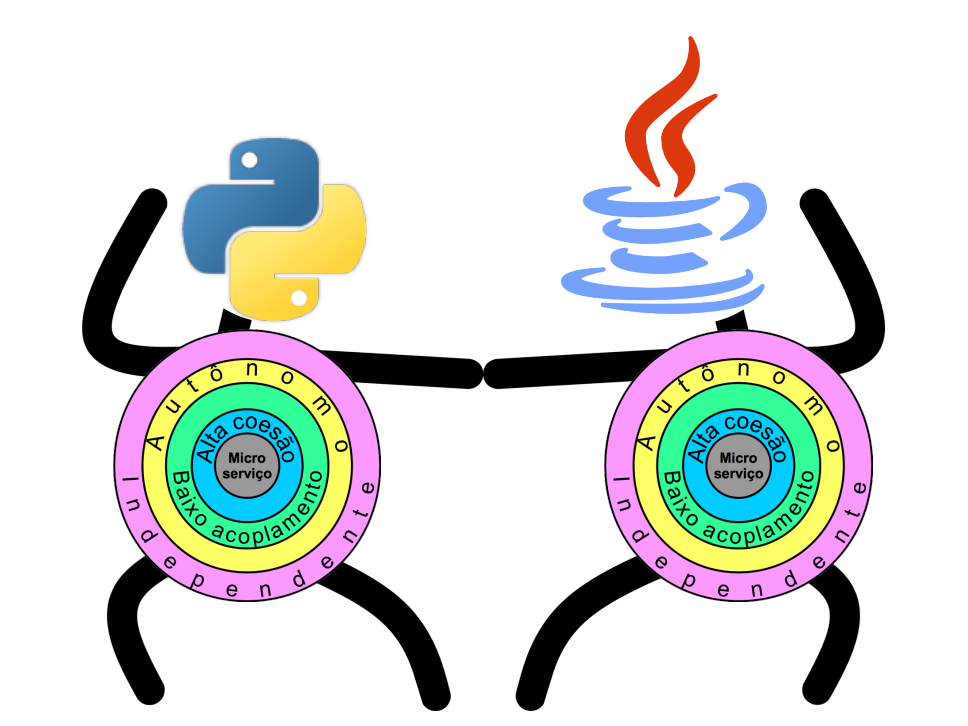
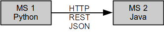
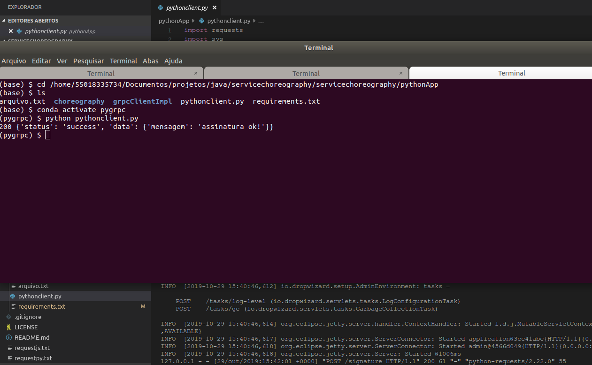
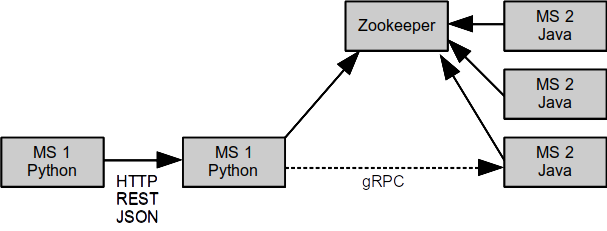
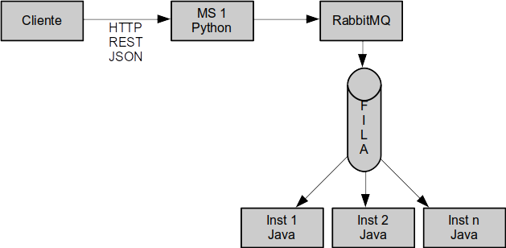

# Orchestration versus Choreography: A Tale of Two Microservices

**Cleuton Sampaio**

[**PORTUGUESE VERSION HERE**](http://www.obomprogramador.com/2019/10/orquestracao-versus-coreografia-um.html)



So you have a handful of microservices there and you don't know exactly how you are going to deploy them, right? That's exactly what I want to talk to you about. I'll show you some insights on the subject, and some possibilities.

In this article, I will use two very simple programs, one in Python and one in Java, to simulate two microservices that must communicate in order to perform a task. What I will show here holds for two or more microservices, regardless of the programming language in which they were coded.

I will show you several useful technologies for implementing microservices, such as:
- **gRPC** for communication;
- **Dropwizard** for standalone **JAX-RS** apps;
- **PJNIUS** to invoke Java classes from Python programs;
- Apache **Zookeeper** and Apache **Curator**, for microservice orchestration;
- Micro services choreography with **RabbitMQ**.

## The simplest option

We have two microservices, and the simplest way to deliver them is to upload two processes (or two containers) that communicate directly.

A Python program that invokes a Java program to verify the digital signature of a text file.





In the previous figure we can see the test of these two services: Python code invokes the Java service (created with Dropwizard) using HTTP and REST.

The complete code for this simple example is at:
- [**Java**](./javaApp/signature);
- [**Python**](./pythonApp/pythonclient.py);

For Python dependencies, see the [requirements file](./pythonApp/requirements.txt);

To run the test just compile the Java code:

```
cd ./javaApp/signature
mvn clean package
```

And to upload the Dropwizard server:

```
java -jar signature-0.0.1-SNAPSHOT.jar server ../src/main/resources/signature.yml
```

This way we can simulate the Python microservice call to Java with this command:

```
python pythonclient.py
```

If all goes well, the JSON result will be this:

```
{'status': 'success', 'data': {'message': 'signature ok!'}}
```

If you Study the source code of both services you'll see that they are quite simple. If you want to know how to create a Dropwizard service in Java, [read my article on the subject.](http://www.obomprogrammer.com/2015/05/micro-servicos-imutáveis-recipe-dos.html)

Ok, the services are working. We can simply package them as Docker Containers and ship them to the production environment.

But, is there something wrong with that approach?
 
**No!** As I like to say, there is no 'right' or 'wrong' in Information Techonogy. There is **working** and **not working**. Are the services working? Great, so nothing is wrong.

Some people may claim that there is no **contingency**. Well, we can run several instances and balance with DNS, or with a **NGINX** reverse proxy, right? That bury the issue.

You see, we are using HTTP, REST and JSON, simple and practical things. Of course I could have used other things, but nothing would be simpler than this.

The relationship of these two examples is a very simple example of **orchestration**. No, I'm not kidding! It's a crude example, of course, but it IS orchestration. We have a flow started and guided by a core service, in this case, the Python service, which starts the flow, invokes each required service, and delivers the result.

Of course there is also external orchestration when the flow conduction is being done outside the service's code. But there is a flow anyway. Orchestration occurs when:
    • There is a predetermined and orderly flow of service invocations;
    • There is a conductor responsible for executing the flow;
    • The conductor knows each service to be invoked and knows the system's and network's architecture.

Although simple, this delivery model needs much manual work to maintain it. For example, if one of the services goes down, simple balancing can cause the customer to fall into a service that is unavailable, leading to errors.

## Zookeeper Orchestration

We need to address some concerns to improve the architecture of our software by increasing its **robustness**. We can implement a more elaborate orchestration, which includes:
    • Independence of service addressing;
    • Balancing instances of microservices;
    • Service monitoring.

Of course we can use an [**ESB - Enterprise Service Bus**](https://en.wikipedia.org/wiki/Enterprise_service_bus) for this task, such as [**TIBCO**](https://www.tibco.com/) or [**Mule**](https://www.mulesoft.com/platform/mule), which would greatly increase the complexity (and cost) of our software.

But we can meet the requirements in a more simple way, by using software like [**Apache Zookeeper**](https://zookeeper.apache.org/). It is not an ESB, but a distributed File System, which allows us to create some **recipes** for services, including orchestration. And that's what I did.

In this version, services still invoke each other, but now they have load balancing by Zookeeper and [**Apache Curator**](https://curator.apache.org/), which is an API for managing services in Zookeeper. Among the features that Curator offers is the [**Service Discovery**](https://curator.apache.org/curator-x-discovery/index.html) which, in addition to balancing, allows you to monitor and disable problematic instances, replacing them.

Basically, the flow is this:



We have a Python server [**using Flask**](https://github.com/pallets/flask) that invokes a Java [**gRPC**](https://grpc.io/) Server. Here, I used the **gRPC** protocol in Python and Java, as it offers the advantages:

- It is slightly faster than HTTP / REST;
- Uses [**Protocol Buffers**](https://developers.google.com/protocol-buffers) for binary message serialization, which allows for a smaller payload.

For inter-service communication gRPC is the best choice.

Before invoking the Java service, **MS1** obtains from Zookeeper (via Apache Curator Service Discovery) the address of one of the servers. Then establish direct connection to it via gRPC.

The folder with this version is in:
- [**Java**](./javaApp/grpcserverjava);
- [**Python**](./pythonApp/grpcClientImpl).

You can supply the Python dependencies by creating an [**Anaconda environment**](https://www.anaconda.com/) [with THIS file](./pythonApp/grpcClientImpl/conda-env.yml).

To run this application:

1. Compile the Java version: “```mvn clean package```”. The gRPC classes will be generated by the maven plugin and placed in classpath;
2. Compile the protocol classes for Python: “```python -m grpc_tools.protoc -I ../../ protos --python_out =. --grpc_python_out =. ../../protos/signature.proto```”. This is only necessary if you want to modify the protocol file;
3. Upload a Zookeeper container: “```docker run --name some-zookeeper -p 2181: 2181 --restart always -d zookeeper```”;
4. Go to the target folder of the Java project and upload 3 instances of gRPC Server:
```
java -jar grpcserverjava-0.0.1-SNAPSHOT-shaded.jar localhost 8090
java -jar grpcserverjava-0.0.1-SNAPSHOT-shaded.jar localhost 8100
java -jar grpcserverjava-0.0.1-SNAPSHOT-shaded.jar localhost 8110
```
    5. Run the Python server: “```python signature_grpc.py```”;

Now we can simulate the client with curl:

```
-H curl -X POST "Content-Type: application / JSON" d "{" textfile "" /home/user/java/servicechoreography/servicechoreography/pythonApp/arquivo.txt","hexSignature":"8ed7b4235f21db78c92e69082df3874c03d4135515cb04ff1592e66d70999d56c504dd8f6dd275f870873639ea8803ddae40272465101935a19a1877c0f07715f0cb65beb839dbf33d691acc30bd3a1af6bcc42a1b86215c6cc230e7f2ff2bcff0452df651c89659a2a6f4c8364f86ab2fccac5d7ca4d15654839aa9723e9c70f15f0699037e0745947f5253545f66b7cd3b549f9e94066c319c4e5945dddf6bafebf165c984cf60c2b4fb4ae8aade21f0a88a637161c9cb6314cf4fd42ad4c4a50337b911126f188e77dc83aeaed97338a5ee53ddc0c3575041413ab11655129f15418838a2a531516276cda5df1f814f3c3ae8986c6663533a3f31aba73e19 "} 'http: // localhost: 5000 / api / signature
```
You need to pass the file path “file.txt” and the digital signature value. All in one line, ok? Here, you can't show it like that.

As we can see, each request calls a different instance of the gRPC server (Round Robin):

```
Service instance: localhost: 8100
127.0.0.1 - - [Oct 29, 2019 13:24:08] "POST / api / signature HTTP / 1.1" 200 -
<Request 'http: // localhost: 5000 / api / signature' [POST]>
<com.obomprogrammer.grpc.ApacheCuratorDiscovery at 0x7f744bb11a10 jclass = com / programmer / grpc / ApacheCuratorDiscovery jself = <LocalRef obj = 0x557ff3632510 at 0x7f744bb014b0 >>
Service instance: localhost: 8110
127.0.0.1 - - [Oct 29, 2019 13:24:37] "POST / api / signature HTTP / 1.1" 200 -
<Request 'http: // localhost: 5000 / api / signature' [POST]>
<com.obomprogrammer.grpc.ApacheCuratorDiscovery at 0x7f744bb11a10 jclass = com / programmer / grpc / ApacheCuratorDiscovery jself = <LocalRef obj = 0x557ff3632510 at 0x7f744bb014b0 >>
Service instance: localhost: 8090
```

Apache Curator Service Discovery allows us to create a monitoring service that would test instances by disabling those that do not respond (Heart beat). I did not implement this in this example, but it is quite simple to do. Take a look at the [**Apache Curator Service Discovery Server**](https://github.com/apache/curator/blob/master/curator-examples/src/main/java/discovery/DiscoveryExample.java), which and doing that.

It is still an example of orchestration, after all, there is a "conductor" that starts the flow. We only provide balancing and monitoring, gaining a little more performance by using gRPC.

It is a more robust solution than the previous one. That's exactly what my Open Source component: [**ServKeeper**](https://github.com/cleuton/servkeeper) does.

### Using Java inside Python

An interesting detail is that Apache Curator Service Discovery is not supported in Python. So I created a [small Java class](./javaApp/grpcserverjava/src/main/java/com/obomprogramador/grpc/ApacheCuratorDiscovery.java) that uses Service Discovery, and used [**PJNIUS**](https://pyjnius.readthedocs.io/en/stable/) to invoke it from within Python code:

```
import jnius_config
import them
jnius_config.set_classpath (os.getenv ('PJNIUS_CLASSPATH'))
print (os.getenv ('PJNIUS_CLASSPATH'))
from jnius import autoclass
```

This PJNIUS_CLASSPATH environment variable points to the Jar path of this Java class, which uses Service discovery.

## Choreography with RabbitMQ

Choreography is a very interesting way to integrate microservices, which reduces the coupling between them. In fact, a service has no idea of which other services are collaborating to serve a flow. In fact, the flow doesn't even exist anymore. It is all done indirectly and asynchronously.

To implement this we need event queue manager software such as [**RabbitMQ**](https://www.rabbitmq.com/) or [**Apache ActiveMQ**](https://activemq.apache.org/).

I chose RabbitMQ because it is much simpler and more practical. The flow is now like this:



Now the Python Service (**MS1**) is totally unaware of the flow it is starting. It just posts a message in one queue and queries the reply in another. There are multiple instances of Java service listening to the first queue. One of them receives the message, processes and posts a reply to another queue.

Task processing is asynchronous and the Python Server has to deal this by providing a GET method for querying the task status.

The path to this version is at:
- [**Java**](./javaApp/choreography);
- [**Python**](./pythonApp/choreography);

To run this solution:

1. Compile the Java project: “```mvn clean package```”;
2. Create a Python virtual environment (Anaconda) to [supply dependencies](./pythonApp/requirements.txt);
3. Run an instance of RabbitMQ with the command: “```docker run -d --hostname my-rabbit --name some-rabbit -p 5672: 5672 rabbitmq: latest```”;
4. Run the [Python server](./pythonApp/choreography) with the command: “```python queueVerifier.py```”;
5. Run the Java listener: “```java -jar choreography-0.0.1-SNAPSHOT-shaded.jar```”
6. Send commands to Server with “curl”:

```
curl -X POST -H "Content-Type: application / json" \
d '{ "textfile" "../arquivo.txt" "hexSignature" "8ed7b4235f21db78c92e69082df3874c03d4135515cb04ff1592e66d70999d56c504dd8f6dd275f870873639ea8803ddae40272465101935a19a1877c0f07715f0cb65beb839dbf33d691acc30bd3a1af6bcc42a1b86215c6cc230e7f2ff2bcff0452df651c89659a2a6f4c8364f86ab2fccac5d7ca4d15654839aa9723e9c70f15f0699037e0745947f5253545f66b7cd3b549f9e94066c319c4e5945dddf6bafebf165c984cf60c2b4fb4ae8aade21f0a88a637161c9cb6314cf4fd42ad4c4a50337b911126f188e77dc83aeaed97338a5ee53ddc0c3575041413ab11655129f15418838a2a531516276cda5df1f814f3c3ae8986c6663533a3f31aba73e19"}' \
http: // localhost: 5000 / api / signature
```

Remember that the parameter “textFile” is the [path of the text file](./pythonApp/arquivo.txt) and “hexSignature” is the digital signature.

The service will answer like this:

```
{"msg": "Verification request sent"}
```

To find out the result, we make another request using GET:

```
curl -X GET -H "Content-Type: application / json" \
http: // localhost: 5000 / api / signature
```

And the result should be like this:

```
{"verified": true, "response": true}
```

What is the advantage? First we can have the same advantages as the Zookeeper solution, such as balancing and monitoring, but with less coupling between services, as the Python Service only posts messages in one queue and reads from another, not knowing to whom it's “talking” to. The Java component was transformed from  “service” to being just a listener, which receives messages and posts messages.

We can “plug in” various services in line without affecting existing ones, increasing system flexibility.

**Cleuton Sampaio**, M.Sc.